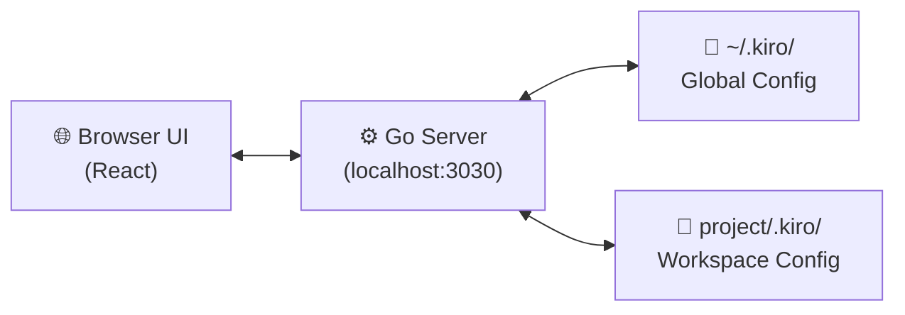

# Config Control for Kiro

> Unleash the full potential of Kiro CLI. Explore, build, and configure agents, MCP servers, steering files, and skills — all at your fingertips through an interactive UI.

https://github.com/user-attachments/assets/1e74c248-07f1-482a-a6d5-6c0ecb9c7bec

## What It Does

**Click each feature below to see it in action.**

- **Dashboard** — See your setup at a glance — how many agents, servers, steering files, and skills you have configured, with a feature adoption checklist.

<details>
<summary>▶️ See Dashboard in action</summary>

https://github.com/user-attachments/assets/b432c09c-114e-4592-a5ca-d8d0682b71b8

</details>

- **Agents** — Create and configure Kiro agents with a visual editor. Set prompts, tools, models, hooks, keyboard shortcuts, and MCP server bindings. Edit the JSON directly or use the config cards — both stay in sync.

<details>
<summary>▶️ See Agents in action</summary>

https://github.com/user-attachments/assets/4706368a-ea93-40e3-80da-98c831724b57

</details>

- **MCP Servers** — Add, remove, enable/disable MCP servers. Test tool connectivity. Toggle individual tools on/off per server.

<details>
<summary>▶️ See MCP Servers in action</summary>

https://github.com/user-attachments/assets/e6c504da-0c8f-460c-8419-7d5b0ce071fd

</details>

- **Steering** — Create and edit steering markdown files with a built-in file tree and editor.

<details>
<summary>▶️ See Steering in action</summary>

https://github.com/user-attachments/assets/84dcbf27-8648-4d4c-b8cd-5f66dc7dc6c7

</details>

- **Skills** — Browse, create, and edit skill folders and SKILL.md files.

<details>
<summary>▶️ See Skills in action</summary>

https://github.com/user-attachments/assets/34d5417c-158a-406d-aa74-9260d408ac57

</details>

- **Workspaces** — Switch between global (`~/.kiro`) and project-level (`.kiro/`) configurations.

<details>
<summary>▶️ See Workspaces in action</summary>

https://github.com/user-attachments/assets/15224882-37d4-4b60-9d99-df68b8b3fe9f

</details>

- **Changelog** — View Kiro CLI release history and check for updates.

<details>
<summary>▶️ See Changelog in action</summary>

https://github.com/user-attachments/assets/557014c1-45ad-49aa-bbcd-658ca4f69cb3

</details>

## Quick Start

### Download a Release

Download, extract, and run on your OS:

| Platform | Download |
|---|---|
| Linux | [cckiro-linux-amd64.tar.gz](https://github.com/kirodotdev-labs/config-control-kiro/releases/latest/download/cckiro-linux-amd64.tar.gz) |
| macOS (Intel) | [cckiro-mac-intel.zip](https://github.com/kirodotdev-labs/config-control-kiro/releases/latest/download/cckiro-mac-intel.zip) |
| macOS (Apple Silicon) | [cckiro-mac-arm.zip](https://github.com/kirodotdev-labs/config-control-kiro/releases/latest/download/cckiro-mac-arm.zip) |
| Windows | [cckiro-windows-amd64.zip](https://github.com/kirodotdev-labs/config-control-kiro/releases/latest/download/cckiro-windows-amd64.zip) |

Or install from the terminal — **select your OS below:**

<details>
<summary>🐧 Linux</summary>

```bash
curl -L -o cckiro-linux-amd64.tar.gz https://github.com/kirodotdev-labs/config-control-kiro/releases/latest/download/cckiro-linux-amd64.tar.gz
tar xzf cckiro-linux-amd64.tar.gz
chmod +x cckiro
./cckiro
```

</details>

<details>
<summary>🍎 macOS (Apple Silicon)</summary>

```bash
curl -L -o cckiro-mac-arm.zip https://github.com/kirodotdev-labs/config-control-kiro/releases/latest/download/cckiro-mac-arm.zip
unzip cckiro-mac-arm.zip
open cckiro.app
```

</details>

<details>
<summary>🍎 macOS (Intel)</summary>

```bash
curl -L -o cckiro-mac-intel.zip https://github.com/kirodotdev-labs/config-control-kiro/releases/latest/download/cckiro-mac-intel.zip
unzip cckiro-mac-intel.zip
open cckiro.app
```

</details>

<details>
<summary>🪟 Windows</summary>

Download [cckiro-windows-amd64.zip](https://github.com/kirodotdev-labs/config-control-kiro/releases/latest/download/cckiro-windows-amd64.zip), extract the zip, then run:

```
cckiro.exe
```

</details>

The app opens in your browser automatically. If it doesn't, paste this into your browser:

```
http://127.0.0.1:3030
```

cckiro only listens on localhost — nothing is exposed to the network.

> ⚠️ **Security alerts when opening the app — this is normal.**
>
> Your OS may show a security warning on first run. **Select your OS below for the fix:**
>
> <details>
> <summary>🍎 macOS — Security warnings</summary>
>
> **Error 1:** *"cckiro" Not Opened — Apple could not verify "cckiro" is free of malware that may harm your Mac or compromise your privacy.*
>
> **Error 2:** *"cckiro" can't be opened because Apple cannot verify it is free from malware.*
>
> This is macOS blocking apps that haven't been notarized by Apple. It does not mean the app contains malware.
>
> **Fix (choose one):**
> 1. **Right-click** `cckiro` → **Open** → click **Open** in the dialog
> 2. Go to **System Settings → Privacy & Security** → scroll to Security → click **Open Anyway**
> 3. Run in terminal: `xattr -d com.apple.quarantine cckiro`
>
> Once allowed, macOS remembers your choice and won't ask again.
>
> **Managed devices:** If your Mac is managed by your organization and the above options are unavailable, ask your IT admin to whitelist `cckiro` via MDM or add it to the approved applications list.
>
> 📖 [Apple — Safely open apps on your Mac](https://support.apple.com/en-us/HT202491)
>
> </details>
>
> <details>
> <summary>🪟 Windows — SmartScreen and Firewall warnings</summary>
>
> **Error 1 — SmartScreen:** *"Windows protected your PC — Microsoft Defender SmartScreen prevented an unrecognized app from starting."*
> - Click **More info** → click **Run anyway** — the app will start normally
>
> **Error 2 — Firewall:** *"Do you want to allow public and private networks to access this app?"*
> - Click **Cancel** — cckiro runs on localhost only and does not need network access. The app will continue to work.
>
> **To permanently trust cckiro (optional):**
> 1. **Windows Security** → **Virus & threat protection** → **Manage settings** → **Exclusions** → add `cckiro.exe`
> 2. **Start** → type **"Allow an app through Windows Firewall"** → **Change settings** → **Allow another app** → browse to `cckiro.exe`
>
> **Managed devices:** If you see *"This setting is managed by your organization"*, contact your IT admin to whitelist `cckiro.exe`.
>
> 📖 [Microsoft — Add an exclusion to Windows Security](https://support.microsoft.com/en-us/windows/add-an-exclusion-to-windows-security-811816c0-4dfd-af4a-47e4-c301afe13b26)
> 📖 [Microsoft — Allow an app through Windows Firewall](https://support.microsoft.com/en-us/windows/risks-of-allowing-apps-through-windows-firewall-654559af-3f54-3dcf-349f-71ccd90bcc5c)
>
> </details>
>
> <details>
> <summary>🐧 Linux</summary>
>
> If you get *"Permission denied"*:
> ```bash
> chmod +x cckiro
> ```
>
> </details>

Use `--no-browser` to start without opening a browser.

### Build From Source

Requires Go 1.22+ and Node.js 18+.

```bash
make build    # builds frontend + Go binary
./cckiro       # run it
```

Other commands:

```bash
make dev      # frontend hot-reload + Go backend (for development)
make test     # run all Go tests
make clean    # remove all build artifacts
make release  # full pipeline: security checks + all platform binaries
```

## How It Works

The app is a single Go binary that embeds a React frontend. When you run it, it starts an HTTP server on localhost and serves the UI. All configuration reads and writes go to your local `.kiro/` directories — nothing leaves your machine.

It supports two modes: **Global** (`~/.kiro/`) for user-wide settings, and **Workspace** (`<project>/.kiro/`) for project-specific overrides.



## Project Structure

```
├── main.go                 # Entry point — HTTP server, routing, middleware
├── internal/
│   ├── system/             # Core config, workspace switching, system info
│   ├── agent/              # Agent CRUD (reads/writes .kiro/agents/*.json)
│   ├── mcp/                # MCP server config + stdio/HTTP tool clients
│   ├── dashboard/          # Aggregated stats and setup status
│   ├── steering/           # Steering file CRUD (.kiro/steering/*.md)
│   ├── skills/             # Skills management (.kiro/skills/)
│   ├── fileexplorer/       # File browser with copy/cut/paste/rename/delete
│   ├── file/               # Simple file browsing and URI generation
│   ├── launcher/           # Cross-platform terminal launcher
│   ├── changelog/          # Kiro CLI changelog parser
│   ├── models/             # Shared data structures
│   └── shared/utils/       # Logger, errors, validation, file operations
├── client/                 # React frontend (Vite + MUI)
│   ├── src/pages/          # Dashboard, Agents, MCP, Steering, Skills, Changelog
│   ├── src/components/     # Reusable UI components
│   ├── src/services/       # API client (centralized axios)
│   ├── src/hooks/          # Custom React hooks
│   └── src/contexts/       # Workspace, clipboard, unsaved changes
├── build/                  # Build scripts and pipeline
└── Makefile                # Build commands
```

## Resources

### ⚡ Create an Agent in 30 Seconds

https://github.com/user-attachments/assets/78b4de1d-4b1d-4f04-a65b-3b75facc1795

### 🎮 KiroPong

Run this workshop in your organization to explore Config Control for Kiro and Kiro CLI features — 45 minutes, no AWS account required.


- 📖 [Workshop Deck](https://cckiro.github.io/assets/kiropong/kiropong.html) — Multi-Agent Configuration with Config Control for Kiro (interactive slides)
- 🔗 [Workshop](https://catalog.us-east-1.prod.workshops.aws/workshops/9a6b7a99-a5dd-47d5-b6d4-4ec1830d0c7f/en-US) — Hands-on workshop (45 minutes, no AWS account required)

🎮 **KiroPong** — Built with a governed multi-agent system in cckiro

https://github.com/user-attachments/assets/28d21030-2e19-4b66-b0a8-96dfa4a48055

## Contributing

We welcome contributions! Report bugs and feature requests via [GitHub Issues](../../issues). See [CONTRIBUTING.md](CONTRIBUTING.md) for the full guide.

The short version: fork the repo → create a branch → make your changes → open a PR to `main`.

## Platform Support

Works on Linux, macOS, and Windows (via WSL). The app detects your environment automatically:

- **Linux** — Native support
- **macOS** — Native support (Intel + Apple Silicon)
- **WSL** — Detects WSL, handles path translation, launches PowerShell terminals
- **Windows** — Run the `.exe` directly or through WSL
